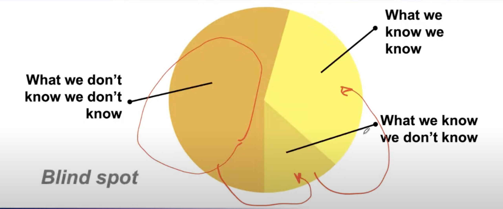
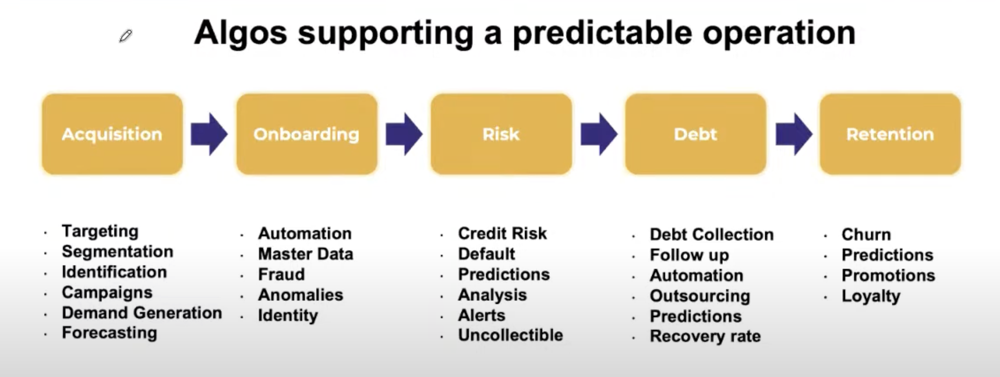
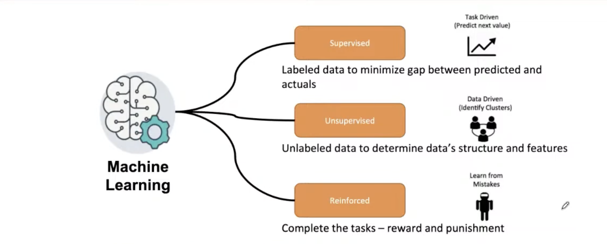
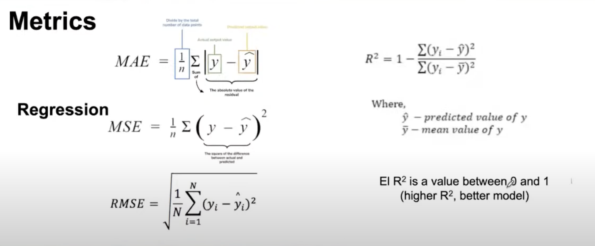
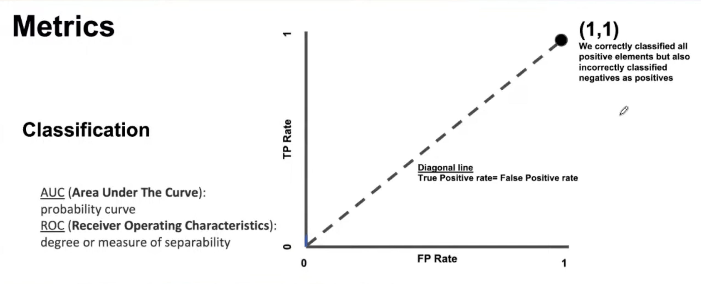
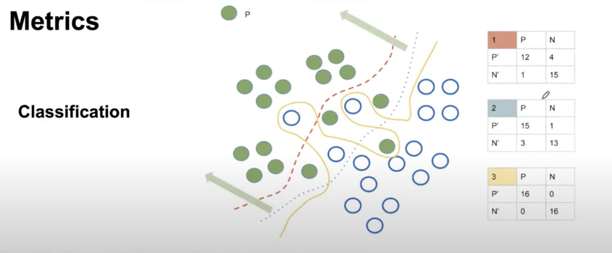
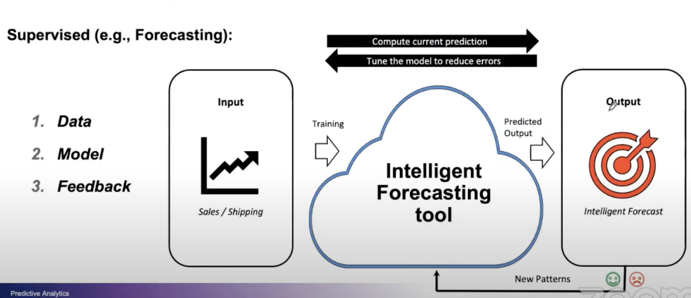
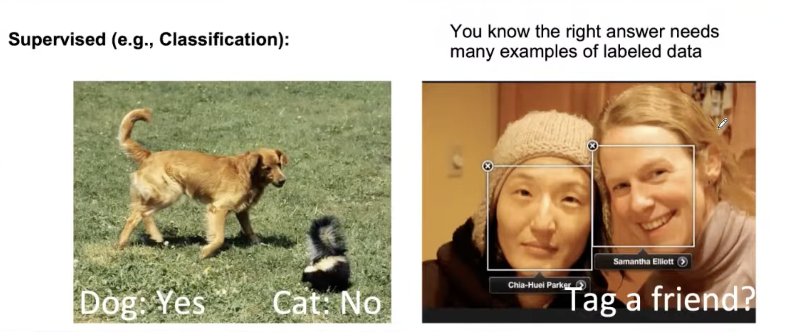
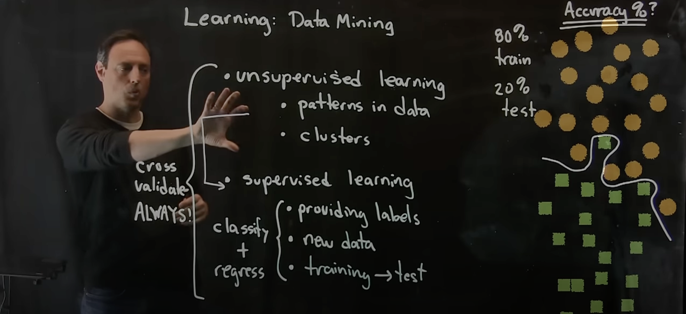
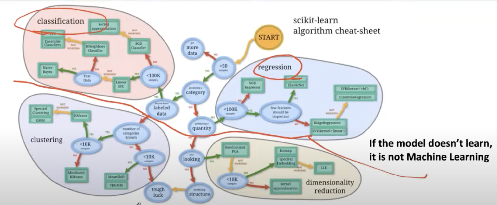

## Type of Business Analytics

Analytics involves the utilization of data-driven models to improve outcomes, minimize expenses, and mitigate risks in both for-profit and non-profit sectors. Eric Siegel introduced the concept of "The prediction effect," highlighting how models forecast individual-level predictions regarding people, documents, actions, or entities (Siegel, 2013). He emphasized that predictive models need not be flawless; they simply must outperform past methodologies.

 
The term "analytics" has become a broad umbrella encompassing various business intelligence and application-related endeavours. It often encompasses statistical and mathematical data analyses across specific domains such as sales, services, supply chain management, healthcare, and fraud detection. Within these domains, analytics can generally be categorized into three fundamental types based on their application objectives: descriptive, predictive, and prescriptive, roughly ordered by complexity.

- **Descriptive analytics** involves scrutinizing data to answer questions like "What happened?" or "What is currently happening?" Visualizations such as bar charts, scatterplots, and histograms, along with summary statistics like mean, median, and correlation coefficients, are frequently employed to extract insights from datasets.

- **Predictive analytics**, on the other hand, concentrates on forecasting continuous variables and categorizing categorical outcomes. Before constructing predictive models, it is imperative to employ descriptive analytics techniques to comprehend, refine, and prepare the data. Methods such as multiple regression, decision trees, and neural networks are among the various predictive analytics models utilized.

- **Prescriptive analytics** represents a more advanced approach that offers recommendations to decision-makers by addressing the question, "What should be done?" Techniques like simulation, recommendation engines, and optimization methods are utilized to develop prescriptive models. Nonetheless, accurate predictive models are fundamental prerequisites for constructing prescriptive models.

Each type of business analytics serves a unique purpose and provides valuable insights that help organizations make data-driven decisions. By leveraging these analytics, companies can gain a competitive edge, improve operational efficiency, and better meet the needs of their customers.   (The Four Types of Business Analytics: Driving Better Business Decisions, 2023).

## Lecture Guidance

### Basic Introduction of Predictive Analytics

### 3 Type of Predictive Analytics

### Why not use Excel

### Algos Supporting a Predictable Operations

### Simple Illustration of Predictive Analytics

### Machine Learning

### Supervised Learning

### Differences between Regression and Classification

### Measuring Regression Performance

### Measuring Classification Performance

### More on Measuring Classification Performance

### Other Evaluation Metrics

### More on Other Evaluation Metrics

### Supervised Learning for Forecasting

### Example of Supervised Learning

### Example of Supervised and Unsupervised Learning

### Journey of Predictive Analytics

### The Big Picture of Predictive Analytics
