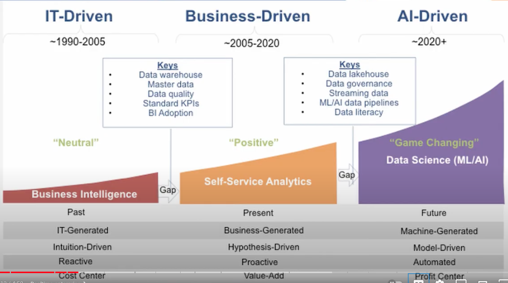
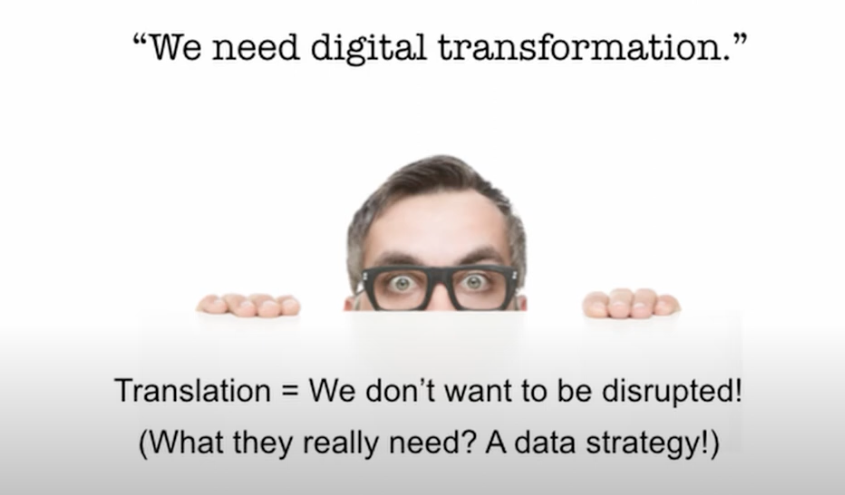

Eckerson suggests that we've entered a fresh era of decision-making, driven by the fields of data science, artificial intelligence, and machine learning. Organizations that are not well-versed in analytics, referred to as "data laggards," might soon realize that their data-savvy competitors, known as "data elites," are flourishing elsewhere. Whether a significant "data divide" is imminent or not, it's essential to examine what distinguishes high-performing entities from the rest in the present context (Eckerson Group, 2020).

 
According to PwC, prosperous enterprises allocate a greater portion of their time to analytics, offer higher compensation to the pertinent experts, and top achievers operate with notably reduced expenses. Another revelation is that the savings they accrue are channelled towards the adoption of emerging technologies and the development of workforce capabilities, facilitating the harnessing of the full potential of these new technologies (PwC, 2017).

## Lecture Guidance

### Evolution of Data Analytics
- Data analytics has evolved from a niche field to a critical component of business operations.

### Data Analytics and AI

### Digital Transformation

## Reference List

- Wayne Eckerson. (2019). The coming divide between ‘data laggards’ and the ‘data elite’ – Eckerson Group. YouTube. Available at: https://www.youtube.com/watch?v=v-TZbNjx7_Y

- PwC. (2017). Finance Effectiveness Benchmark Report 2017 - PwC UK. https://www.pwc.co.uk/finance/finance-matters/insights/finance-effectiveness-benchmark-report-2017.html.

- PwC. (2018). The evolving role of finance. https://www.pwc.com/my/en/services/consulting-index/finance/finance-evolving-role.html.

- Team IRIS CARBON. (April 19, 2023). Financial Data Analytics: Shaping the Future. IRIS CARBON. https://iriscarbon.com/winning-with-data-how-financial-data-analytics-is-shaping-the-future-of-finance/

